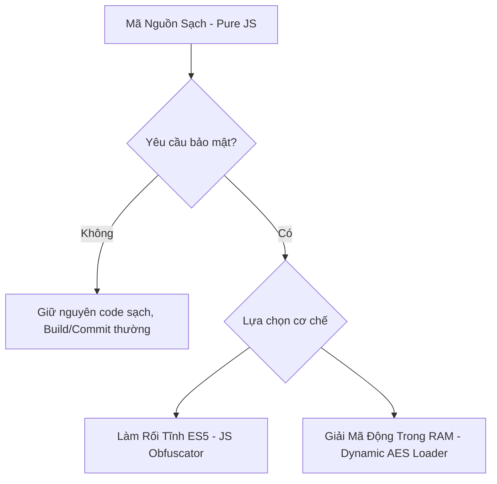

# QUY TRÌNH BẢO MẬT & MÃ HÓA MÃ NGUỒN EXTENSION (SOP)

Tài liệu này định nghĩa quy chuẩn vận hành tiêu chuẩn (SOP) đối với việc bảo mật, làm rối (obfuscate), và mã hóa (encrypt) mã nguồn của các extension thuộc dự án VBook.

---

## 🚨 NGUYÊN TẮC VÀNG CỐT LÕI

> [!IMPORTANT]
> **CHỈ THỰC HIỆN MÃ HÓA HOẶC LÀM RỐI KHI ĐƯỢC YÊU CẦU TƯỜNG MINH!**
> 
> Trong suốt quá trình phát triển thông thường, toàn bộ mã nguồn của các extension (kể cả các extension khó) **bắt buộc phải lưu giữ ở dạng mã nguồn sạch (Pure, Readable JS)** để phục vụ công tác gỡ lỗi (debugging), bảo trì và đánh giá chất lượng mã nguồn từ AI-Agent hoặc Nhà phát triển khác. Chỉ kích hoạt luồng mã hóa bảo mật khi có yêu cầu đóng gói ZIP phát hành sản phẩm.

---

## 1. Khi Nào Cần Áp Dụng Mã Hóa?

Mã hóa/làm rối được áp dụng khi dự án phát triển các extension có độ khó cao (từ 8/10 trở lên) hội tụ các đặc điểm sau:
1. Chứa các khóa giải mã tĩnh (Static Decryption Keys) như MD5, AES, XOR nhạy cảm thu thập được từ mã nguồn gốc của các website truyện/video.
2. Chứa thuật toán bypass hoặc bóc tách chữ ký bảo mật độc quyền của các hệ thống lớn.
3. Nhận được **Yêu Cầu Tường Minh** từ Chủ dự án trước khi thực hiện lệnh Build ZIP và Commit sản phẩm lên git.

---

## 2. Hai Giải Pháp Bảo Mật Tiêu Chuẩn Trong Dự Án

Mọi kỹ thuật bảo mật mã nguồn trong dự án này phải đảm bảo khả năng tương thích tuyệt đối với công cụ **Rhino (JavaScript ES5 Engine)** trên hệ điều hành Android.



### Giải Pháp A: Làm Rối Tĩnh ES5 (Static Obfuscation)
Sử dụng thư viện CLI `javascript-obfuscator` để mã hóa chuỗi tĩnh và làm rối tên biến.

*   **Lệnh CLI Tiêu Chuẩn**:
    ```bash
    javascript-obfuscator ./src/chap.js --output ./dist/chap.js \
      --target "es5" \
      --compact true \
      --self-defending false \
      --string-array true \
      --string-array-encoding 'rc4' \
      --string-array-threshold 1 \
      --rename-globals false \
      --unicode-escape-sequence true
    ```
*   *Lưu ý đặc biệt*:
    *   Bắt buộc đặt `--target "es5"` để đảm bảo tương thích công cụ Rhino.
    *   Bắt buộc đặt `--rename-globals false` để bảo vệ hàm lối vào chính `execute()`.

### Giải Pháp B: Giải Mã Động Trong Bộ Nhớ (Dynamic AES Loader)
Mã hóa toàn bộ nội dung tệp JS gốc thành một asset nhị phân/chuỗi mã hóa AES (`chap.enc`). Tệp đóng gói thực tế chỉ là một Bootstrap Loader siêu nhẹ thực hiện giải mã động code gốc trong RAM và thực thi bằng hàm khởi tạo `new Function()`.

*   **Mẫu Bootstrap Loader tiêu chuẩn**:
    ```javascript
    load('config.js');
    try { load('crypto.js'); } catch (e) {}

    function execute(url) {
        try {
            // Nạp dữ liệu mã hóa tĩnh từ Asset cục bộ hoặc mạng
            var encryptedPayload = fetchPage(BASE_URL + "/extensions/kychi_mangago/src/chap.enc").text(); 
            var secretKey = 'my-secret-salt-key-for-mangago-ext';
            
            // Giải mã dynamically trong RAM
            var decryptedBytes = CryptoJS.AES.decrypt(encryptedPayload, secretKey);
            var decryptedCode = decryptedBytes.toString(CryptoJS.enc.Utf8);
            
            if (!decryptedCode) return Response.error('Security bootstrap failed.');
            
            // Thực thi dynamically mã nguồn sạch mà không lưu lại trên tệp tin vật lý
            var runtimeExec = new Function('url', decryptedCode + "\nreturn execute(url);");
            return runtimeExec(url);
        } catch (e) {
            return Response.error('Bootstrap error: ' + e.message);
        }
    }
    ```

---

## 3. Quy Trình Vận Hành (Handoff Flow) Cho Lập Trình Viên & AI-Agent

Khi nhận nhiệm vụ trên một extension phức tạp, hãy tuân thủ quy trình sau:

```
[BƯỚC 1] ──> Phát triển extension bằng mã nguồn sạch (Pure, Readable JS)
               │
[BƯỚC 2] ──> Chạy thử nghiệm tự động bằng mock test runner để bảo đảm logic 100% chính xác
               │
[BƯỚC 3] ──> Gỡ bỏ toàn bộ script thử nghiệm/logs nháp để dọn sạch codebase
               │
[BƯỚC 4] ──> KIỂM TRA YÊU CẦU:
               ├──> NẾU KHÔNG CÓ YÊU CẦU MÃ HÓA:
               │      Tiến hành commit / đóng gói bình thường ở dạng code sạch.
               └──> NẾU CÓ YÊU CẦU MÃ HÓA TỪNG MINH:
                      1. Backup code sạch sang thư mục riêng tư / cấu hình ảo.
                      2. Chạy công cụ mã hóa (Giải pháp A hoặc B).
                      3. Đóng gói ZIP bản đã mã hóa.
                      4. Commit bản đã mã hóa lên git theo đúng yêu cầu bảo mật.
```

---

*Tài liệu này là quy chuẩn chung của toàn bộ dự án. Mọi hành vi làm rối mã nguồn không thông qua yêu cầu tường minh được coi là vi phạm SOP gỡ lỗi của dự án.*
