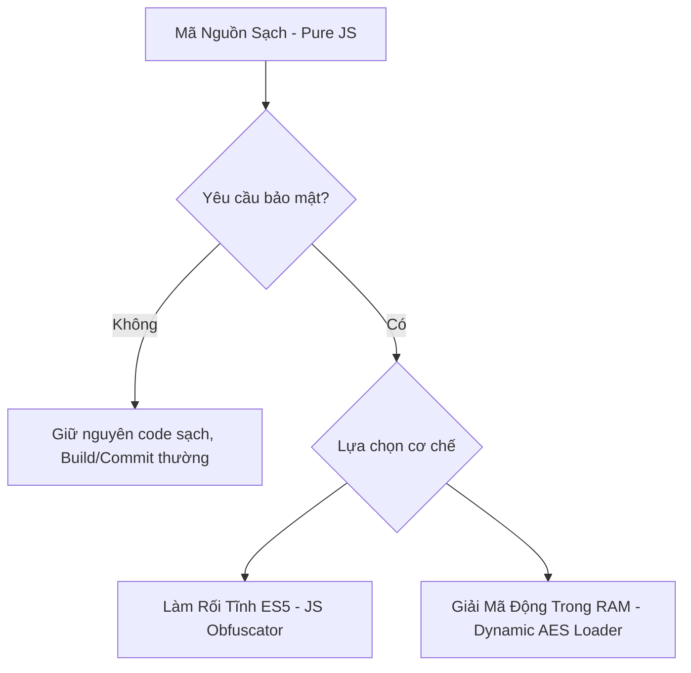

# QUY TRÌNH BẢO MẬT & MÃ HÓA MÃ NGUỒN EXTENSION (SOP)

Tài liệu này định nghĩa quy chuẩn vận hành tiêu chuẩn (SOP) đối với việc bảo mật, làm rối (obfuscate), và mã hóa (encrypt) mã nguồn của các extension thuộc dự án VBook.

---

## 🚨 NGUYÊN TẮC VÀNG CỐT LÕI

> [!IMPORTANT]
> **CHỈ THỰC HIỆN MÃ HÓA HOẶC LÀM RỐI KHI ĐƯỢC YÊU CẦU TƯỜNG MINH!**
> 
> Trong suốt quá trình phát triển thông thường, toàn bộ mã nguồn của các extension (kể cả các extension khó) **bắt buộc phải lưu giữ ở dạng mã nguồn sạch (Pure, Readable JS)** để phục vụ công tác gỡ lỗi (debugging), bảo trì và đánh giá chất lượng mã nguồn từ AI-Agent hoặc Nhà phát triển khác. Chỉ kích hoạt luồng mã hóa bảo mật khi có yêu cầu đóng gói ZIP phát hành sản phẩm.

---

## 1. Khi Nào Cần Áp Dụng Mã Hóa?

Mã hóa/làm rối được áp dụng khi dự án phát triển các extension có độ khó cao (từ 8/10 trở lên) hội tụ các đặc điểm sau:
1. Chứa các khóa giải mã tĩnh (Static Decryption Keys) như MD5, AES, XOR nhạy cảm thu thập được từ mã nguồn gốc của các website truyện/video.
2. Chứa thuật toán bypass hoặc bóc tách chữ ký bảo mật độc quyền của các hệ thống lớn.
3. Nhận được **Yêu Cầu Tường Minh** từ Chủ dự án trước khi thực hiện lệnh Build ZIP và Commit sản phẩm lên git.

---

## 2. Hai Giải Pháp Bảo Mật Tiêu Chuẩn Trong Dự Án

Mọi kỹ thuật bảo mật mã nguồn trong dự án này phải đảm bảo khả năng tương thích tuyệt đối với công cụ **Rhino (JavaScript ES5 Engine)** trên hệ điều hành Android.



### Giải Pháp A: Làm Rối Tĩnh ES5 (Static Obfuscation)
Sử dụng thư viện CLI `javascript-obfuscator` để mã hóa chuỗi tĩnh và làm rối tên biến.

*   **Lệnh CLI Tiêu Chuẩn**:
    ```bash
    javascript-obfuscator ./src/chap.js --output ./dist/chap.js \
      --target "es5" \
      --compact true \
      --self-defending false \
      --string-array true \
      --string-array-encoding 'rc4' \
      --string-array-threshold 1 \
      --rename-globals false \
      --unicode-escape-sequence true
    ```
*   *Lưu ý đặc biệt*:
    *   Bắt buộc đặt `--target "es5"` để đảm bảo tương thích công cụ Rhino.
    *   Bắt buộc đặt `--rename-globals false` để bảo vệ hàm lối vào chính `execute()`.

### Giải Pháp B: Mã Hóa AES-256 Tích Hợp Nhân Ứng Dụng (Native VBook Engine AES-256)

Ứng dụng vBook trên Android sở hữu một bộ giải mã tích hợp sẵn (Unified Engine). Khi tệp `plugin.json` của Extension khai báo `"encrypt": true` trong khối `metadata`, ứng dụng vBook sẽ tự động kích hoạt bộ giải mã động trong RAM để giải mã toàn bộ các tệp `.js` khi tải Extension.

* **Cơ chế hoạt động**:
  1. Ứng dụng vBook sinh ra danh sách khóa (Key Matrix) từ thông tin `name`, `author`, `source` kết hợp các chuỗi `salt` hệ thống (như `'com.vbook.app'`).
  2. Bất kỳ Extension nào cũng luôn chứa một cặp khóa phổ quát (Universal Master Key):
     * **Payload**: `'com.vbook.appadmin'`
     * **AES Key**: `SHA-256(MD5('com.vbook.appadmin'))`
     * **IV**: Null (16 bytes số 0)
     * **Mode**: `AES-256-CBC`
  3. Mã nguồn sạch sẽ được mã hóa và thay thế các ký tự Base64 chuẩn sang Base64-Token đặc trưng của vBook (`+` -> `x0P1Xx`, `/` -> `x0P2Xx`, `=` -> `x0P3Xx`).
  4. Trình duyệt/App Android khi tải Extension sẽ giải mã động toàn bộ trong bộ nhớ RAM, bảo đảm an toàn mã nguồn 100% mà không bị lộ file text thuần.

* **Quy trình đóng gói AES-256 Tự động hóa**:
  Ta sử dụng tập lệnh tự động hóa đóng gói trong bộ nhớ `scratch/encrypt_and_build.js` để mã hóa và đóng gói Extension:
  1. Tự động sao lưu tạm thời toàn bộ mã nguồn sạch của thư mục `src/` vào bộ nhớ RAM.
  2. Thực hiện mã hóa AES-256 in-place toàn bộ các file `.js` trong `src/` và ghi tạm thời cờ `"encrypt": true` vào `plugin.json`.
  3. Biên dịch và xuất tệp đóng gói `plugin.zip` đã được mã hóa an toàn.
  4. Ngay lập tức khôi phục lại mã nguồn sạch gốc (`src/`) và tệp `plugin.json` ở local để lập trình viên tiếp tục debug và sửa đổi bình thường trên máy tính!

---

## 3. Quy Trình Vận Hành (Handoff Flow) Cho Lập Trình Viên & AI-Agent

Khi đóng gói một extension bảo mật, hãy tuân thủ quy trình sau:

```
[BƯỚC 1] ──> Phát triển extension bằng mã nguồn sạch (Pure, Readable JS) trực tiếp tại src/
               │
[BƯỚC 2] ──> Sửa lỗi và kiểm thử chức năng ở trạng thái code sạch 100% dễ dàng
               │
[BƯỚC 3] ──> Chạy kịch bản đóng gói mã hóa trong bộ nhớ:
               │   node scratch/encrypt_and_build.js
               │
[BƯỚC 4] ──> Pipeline tự động tạo ra plugin.zip mã hóa AES-256, đồng thời tự khôi phục
               │   lại code sạch tại local src/ sau khi biên dịch xong.
               │
[BƯỚC 5] ──> Commit tệp plugin.zip và plugin.json đã mã hóa lên Gitea repository.
```

---

*Tài liệu này là quy chuẩn chung của toàn bộ dự án. Mọi hành vi đóng gói không tuân thủ quy chuẩn bảo mật trên sẽ bị coi là vi phạm nguyên tắc vận hành dự án.*
